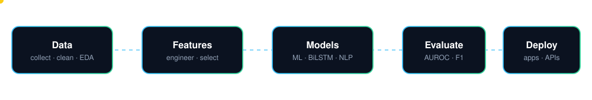
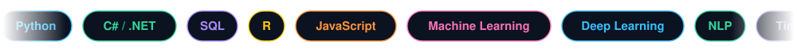

  

  

  
  
  

## About Me

I am a **developer** working across **.NET** and **Artificial Intelligence & Data Science**. I build software with C# and Python, turn raw data into insight, and train machine-learning and deep-learning models, then present the results through clear visualizations and applications.

| Domain | What I work on |
|---|---|
| **.NET** | C# and .NET application development |
| **AI & Data Science** | Data wrangling, EDA, statistics, analytics, visualization |
| **AI / ML** | Machine learning, deep learning, NLP, time-series modeling |
| **Developer** | Python, JavaScript, SQL, APIs, web apps, Git, cloud |
| **Currently learning** | MLOps · AWS / GCP · Scalable ML systems · LLM applications |

## Publication

## Technical Skills

**.NET**

**AI & Data Science**

 
     

**AI / ML**

**Developer**

<b>Detailed competency map</b>

 

| Domain | Skills |
|---|---|
| .NET | C#, .NET |
| AI & Data Science | Python, R, SQL, NumPy, Pandas, EDA, statistics, Tableau, Matplotlib, Seaborn |
| AI / ML | Scikit-learn, feature engineering, model evaluation, TensorFlow, PyTorch, NLP, time-series |
| Developer | Python, C#, JavaScript, SQL, FastAPI, Streamlit, React, Git, VS Code |
| In Progress | MLOps, AWS, GCP |

## GitHub Analytics

  
  

  

  

## Connect

  
  
  

